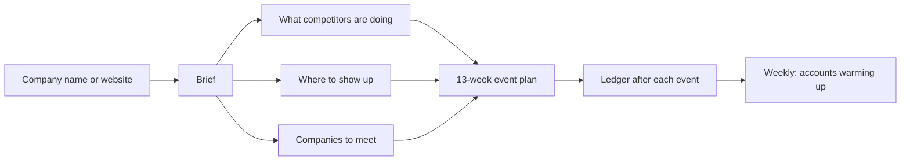

# field-kit

Work out an event plan for your scaling company. A skill for Claude, ChatGPT and Codex.

Give it your company name or website. It shows what your competitors are doing, where your buyers gather, and which companies you want in the room. Then it turns that into a 13-week calendar with costs, and tracks what each event produced.

## The problem

Most scaling companies pick events by habit, or because someone asked. They pay for a big sponsorship, come home with badge scans, and cannot say what it produced. Nobody decided who they wanted to meet, so nobody follows up.

field-kit fixes that in order:

| Problem | What field-kit does |
| --- | --- |
| Events picked by habit | Shows where your competitors show up and where your buyers go |
| Sponsorships that produce badge scans | Plans smaller rooms you run yourself: dinners, demo nights, co-hosted meetups |
| No idea who to meet | Builds a list of companies to meet, or checks yours |
| Can't say what an event produced | Logs every event against that list, with cost per company reached |
| No follow-up | A weekly list of companies showing buying signals, with one next step each |

## What you get



| Ask | Output |
| --- | --- |
| "Build us an event plan" | A brief, competitor activity, a shortlist of events, a list of companies to meet, and a 13-week calendar with costs |
| "What are our competitors doing?" | Their events, own programmes, hiring and launches in your region, and the rooms nobody covers |
| "Which events should we do in Europe?" | Conferences ranked by audience fit, recurring meetups, and a note to each organiser asking for the attendee companies |
| "Who should we meet?" | A reviewed list of companies: from your list, like your customers, or built from your buyer profile |
| "Log last night's dinner" | Who came, which target companies were there, and what it cost per company |
| "Which accounts should we work this week?" | Companies with dated buying signals, one next step and one owner each |

## Install

Claude Code:

```
/plugin marketplace add b1rdmania/field-kit
/plugin install field-kit@field-kit
```

Codex CLI, then install from the plugin browser:

```
codex plugin marketplace add b1rdmania/field-kit
```

Claude.ai or ChatGPT: upload the `skills/field-kit` folder as a skill.

## Use

Say "build us an event plan for <your company>". field-kit researches the company, drafts `field/brief.md`, and asks only what it could not find: buyers, region, budget, past events, what a win is.

If you already use a product-marketing context file (`.agents/product-marketing.md`), field-kit reads it first.

Output goes to `field/out/`. `examples/larkspur/` has a filled brief and target list for a made-up company.

## Search

Research uses [Exa](https://exa.ai) with your own key. If no Exa key is set, field-kit uses Perplexity, then the host's web search.

```bash
EXA_API_KEY=...          # preferred
PERPLEXITY_API_KEY=...   # used if no Exa key
```

Set either key in the environment or in a `.env` file in the working folder.

## Requirements

`python3` and `curl` for the search script. Without them, the skill uses the host's web search.

## What it doesn't do

- It does not contact anyone. It drafts messages only on request and never sends them.
- It does not connect to a CRM. Meetings, opportunities and pipeline come from your sales team.
- It cannot see who attends an event. Public pages rarely say. Confirmed attendance comes from the organiser or your own guest lists.
- It does not commit guest lists. Git ignores `field/`, because guest lists contain personal data.

## Why this exists

Built for a field marketing role I didn't get. Three years of running events for a crypto foundation, the last one a summit in Vienna for 600 people across six venues. The hard part was never the venue. It was deciding which events were worth it, and proving it afterwards.

## Licence

MIT

## Privacy and terms

Research uses Exa or Perplexity with your key, or your AI host's search. Output stays in your `field/` folder.
Check research and costs before acting. The MIT License applies.

[Privacy policy](https://github.com/b1rdmania/field-kit/blob/main/PRIVACY.md) · [Terms and conditions](https://github.com/b1rdmania/field-kit/blob/main/TERMS.md)
