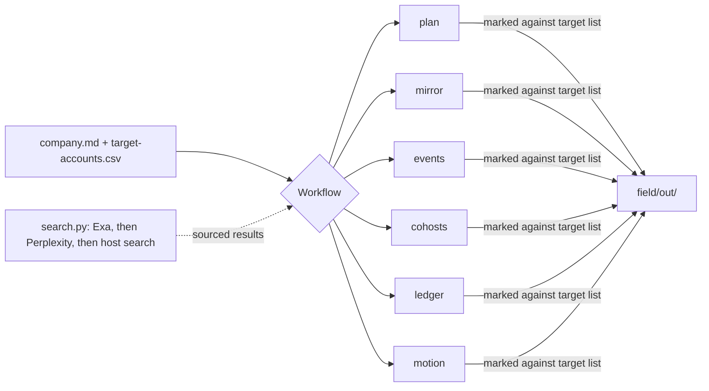

# field-kit

Plans and runs event-led pipeline for B2B teams, starting from the target account list. A skill for Claude, ChatGPT and Codex.

## What it does



| Ask | Output |
| --- | --- |
| "Write a 90-day field plan for London" | Goal, accounts by tier, a 13-week calendar, budget and measures, in two pages |
| "Find companies in Europe like our customers" | Lookalike accounts by city, each with a source, marked against the target list |
| "Which events do our competitors run?" | Competitor events, the region's calendar, the target accounts at each event, and the gap |
| "Who runs AI developer meetups in Berlin?" | Recurring rooms, who runs them, size and last date seen |
| "Log last night's demo night" | An attendee sheet and one row in a ledger of every event |
| "Which accounts are in motion this week?" | Accounts with dated signals, a score, one play and one owner |

## Install

Claude Code:

```
/plugin marketplace add b1rdmania/field-kit
/plugin install field-kit@field-kit
```

Codex CLI, then install from the plugin browser:

```
codex plugin marketplace add b1rdmania/field-kit
```

Claude.ai or ChatGPT: upload the `skills/field-kit` folder as a skill.

## Usage

Ask for any row in the table. On the first run, field-kit creates a `field/` folder and asks for:

1. `field/company.md`: what you sell, who buys, competitors, region, budget, and what a win is.
2. `field/target-accounts.csv`: your target accounts. If you have none, ask for a mirror of your customers.

Output goes to `field/out/`. `examples/larkspur/` has a filled `company.md` and target list for a made-up company.

## Search

Research uses [Exa](https://exa.ai) with your own key. If no Exa key is set, field-kit uses Perplexity, then the host's web search. Exa gives the best results for company search and lookalikes.

```bash
EXA_API_KEY=...          # preferred
PERPLEXITY_API_KEY=...   # used if no Exa key
```

Set either key in the environment or in a `.env` file in the working folder. The search script runs in Claude Code and Codex. On Claude.ai and ChatGPT the skill uses the host's search.

## What it doesn't do

- It does not contact anyone. It drafts messages only on request and never sends them.
- It does not connect to a CRM. Meetings, opportunities and pipeline come from the sales team.
- It does not look up people. It names a person only when a public source names them in that role.
- It does not commit guest lists. Git ignores `field/`, because guest lists contain personal data.

## Project structure

```
plugin.json              portable manifest for ChatGPT and Codex
.claude-plugin/          Claude Code manifest and marketplace
skills/field-kit/
  SKILL.md               setup, search rules, workflow router
  workflows/             plan, mirror, events, cohosts, ledger, motion
  templates/             company.md, target accounts, customers, signals
  scripts/search.py      Exa, Perplexity, or exit 2 for host search
examples/larkspur/       sample company and target list
```

## Licence

MIT
